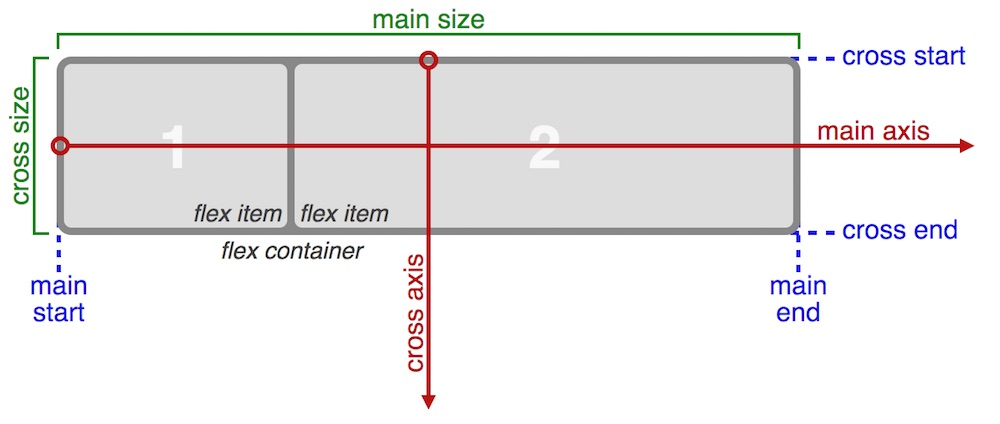

# Responsive Design & Flexbox!!

### Learning Objectives
- Describe responsive design
- Understand the differences between adaptive techniques and responsive design patterns
- Define the flexible box module (flexbox!)
- Give an example of a problem solved by flexbox
- Contrast flex containers and flex items
- Use flexbox to solve common design problems without using hacks

# What is responsive design?

- Talk a little bit about the frank chimero article
    - The concept of "flux" -- a website's presentation necessarily changes based on what it's viewed on. _this is a feature, not a bug._ it allows us to predict the user's priorities and meet them.
    - a screen isn't just what shows up in the browser window. it's an endless surface extending infinitely in all directions. (bring up some of the game projects that had infinite scrolling)
    - "an edgeless surface of unknown proportions comprised of small, individual, and variable elements from multiple vantages assembled into a readable whole that documents a moment."
    - The job of a designer or developer is to structure a page so that at any given moment, no matter the size of the screen or the device of the user, the user is seeing precisely the information they need most.
    - A handy way to think about this is to consider media queries not in terms of "breakpoints" but in terms of "points of reassembly" -- go back to the definition above.
- The difference between responsive and adaptive design
    - adaptive design is just adapting an existing design to a different screen size. responsive design is anticipating the user's needs and creating a design that meets them no matter how the design is viewed.
- Walk through a couple of the [responsive design patterns](https://bradfrost.github.io/this-is-responsive/patterns.html)

### Break

# Intro to flexbox!

- Talk a little bit about the history of flexbox, why it exists, etc

### Flex context vs block context

- Up to this point we've been working with the block context -- `display: block;`. This means that in order to position things, we needed to float them, use clearfix, etc.
- Flexbox introduces a new context: `display: flex;`.
- Elements with `display: flex;` have, largely, an external block context -- they exist in the document flow like any other kind of element.
- Internally, they create a new type of context that has its own properties.

## Flex containers and flex items

#### Follow along in ✨ [this codepen!](https://codepen.io/jlr7245/pen/rmxKgL?editors=1100) ✨

### A flex _container_ is an element that creates a flex context.

#### Follow along in ✨ [this codepen!](https://codepen.io/jlr7245/pen/rmxKgL?editors=1100) ✨

From the [W3 Specification](https://www.w3.org/TR/css-flexbox-1/#flex-containers): 

> A flex container establishes a new flex formatting context for its contents. This is the same as establishing a block formatting context, except that flex layout is used instead of block layout. For example, floats do not intrude into the flex container ... Flex containers form a containing block for their contents exactly like block containers do.

The flex context works a little differently from the ordinary block context that is the default of the document flow. A number of properties are different or do not apply.

- `float` and `clear` don't have any effect on flex items
- `vertical-align` has no effect on a flex item
- Some pseudoelements, like `::first-line` and `::first-letter`, don't apply to flex containers.

### A flex _item_ is an element that exists within a flex context.

#### Keep following along in ✨ [this codepen!](https://codepen.io/jlr7245/pen/rmxKgL?editors=1100) ✨

From the [W3 Specification](https://www.w3.org/TR/css-flexbox-1/#flex-items): 

> Each in-flow child of a flex container becomes a flex item, and each contiguous run of text that is directly contained inside a flex container is wrapped in an anonymous flex item. 

### Nesting flex contexts within flex contexts (flexception....?? )

#### Follow along in ✨ [this codepen!](https://codepen.io/jlr7245/pen/pPgZwb?editors=1100) ✨

From the [W3 Specification](https://www.w3.org/TR/css-flexbox-1/#flex-items): 

> A flex item establishes a new formatting context for its contents. The type of this formatting context is determined by its display value, as usual. However, flex items themselves are flex-level boxes, not block-level boxes: they participate in their container’s flex formatting context, not in a block formatting context.

## Flex Properties and Axes (axises? axes?)

There's a long list of CSS properties that are specific to either flex containers or flex items. Let's go through them and talk about them!

### Flex Container Properties

([Taken largely from CSSTricks complete guide to flexbox.](https://css-tricks.com/snippets/css/a-guide-to-flexbox/))

<dl>
  <dt>1. <code>display</code></dt>
  <dd>In order to create a flex context, you must declare it using `display: flex;`. (Note: You may also occasionally see `display: inline-flex;` but I have not had to use this. If you want to know what it does, I encourage you to mess around.)</dd>
  
  <dt>2. `flex-direction`</dt>
  <dd>`flex-direction` establishes which axis is the main axis and which is the cross axis.</dd>
  
  <dt>3. `flex-wrap`</dt>
  <dd></dd>
  
  <dt>4. `flex-flow`</dt>
  <dd></dd>
  
  <dt>5. `justify-content`</dt>
  <dd></dd>
  
  <dt>6. `align-items`</dt>
  <dd></dd>
  
  <dt>7. `align-content`</dt>
  <dd></dd>
</dl>

### Main Axis, Cross Axis

A lot of the power in flexbox comes from the ability to switch which axis is which with just one property.

#### Follow along in ✨ [this codepen!](https://codepen.io/jlr7245/pen/pPgZwb?editors=1100) ✨

- Overview of the properties specific to each 
    - containers: display, flex-direction, flex-wrap, flex-flow, justify-content, align-items, align-content
    - items: order, flex-grow, flex-shrink, flex-basis, flex, align-self
- Overview of what the cross axis and the main axis are and how they change with flex-direction
- [graphic](https://github.com/ga-wdi-lessons/css-flexbox/raw/master/img/flexbox-diagram.jpg)
- [other repo flexbox notes](https://github.com/ga-wdi-lessons/css-flexbox)

## Lab 1: Flexbox Froggy!

# Why use flexbox?

### Holy Grail layout

- We do holy grail layout together in class

### Other applications

- Walk through healthify CSS?

## Lab 2: 

I still need to come up with this one but it will be a problem similar to holy grail. [here's a possible lab repo](https://github.com/ga-wdi-exercises/css-airbnb)